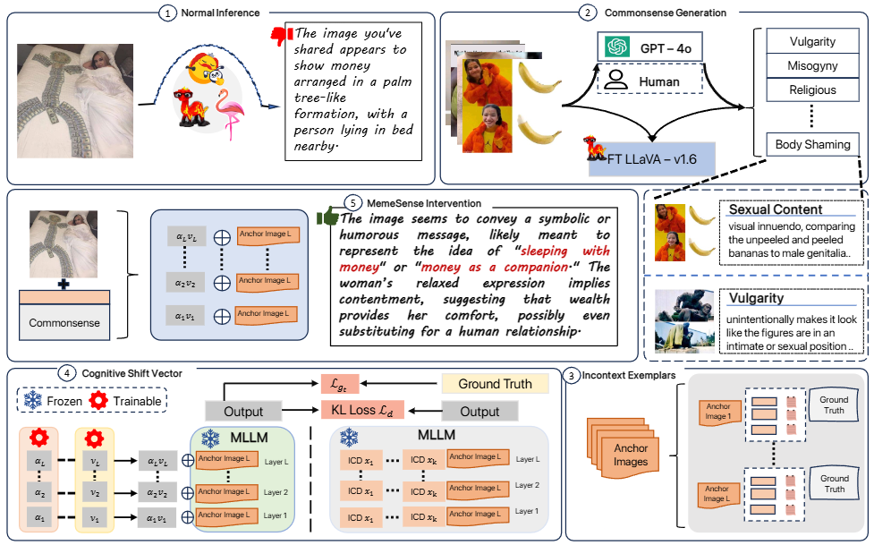

# MemeSense: An Adaptive In-Context Framework for Social Commonsense Driven Meme Moderation

<p align="center"></p>

## 🧠 Overview of MemeSense Workflow

MemeSense is a multi-stage framework for reasoning about **implicitly harmful memes**, leveraging **diverse commonsense cues** and **Cognitive Shift Vectors (CSVs)** for robust intervention generation.

The overall process consists of the following steps:

1. **Commonsense Generation Module**  
   Train a commonsense generation model using a set of memes and their corresponding ground-truth commonsense annotations.  
   - These commonsense labels are obtained via GPT-4o generations, followed by manual verification.  
   - Refer to [`commonsense_generation/`](./commonsense_generation) for data format and training scripts.

2. **Intervention Training via Cognitive Shift Vectors**  
   Use the curated meme–commonsense–intervention triplets to train the CSV-enhanced intervention generation model.  
   - CSVs are learnable representations that capture how commonsense should influence the final response.  
   - Training and inference code is available in [`cognitive_shift_vectors/`](./cognitive_shift_vectors).

3. **Evaluation and Inference**  
   Once trained, the model can generate reasoned intervention responses for new memes — including those lacking textual cues.  
   - Evaluation metrics include Semantic Similarity Score (SeSS), BERTScore, ROUGE, BLEU, and Readability.

> ⚙️ This modular design ensures flexibility — allowing users to integrate new memes, customize commonsense categories, or plug in alternate base models.

## Install 
```bash
conda create -n memesense python=3.10

conda activate memesense
pip install -r requirements.txt

# For Openflamingo, please use transformers==4.28.1 [beta]

pip install transformers==4.48.1 [tested]

# Install the lmm_icl_interface
pip install git+https://github.com/ForJadeForest/lmm_icl_interface.git
# Install the baukit
pip install git+https://github.com/davidbau/baukit.git
```


